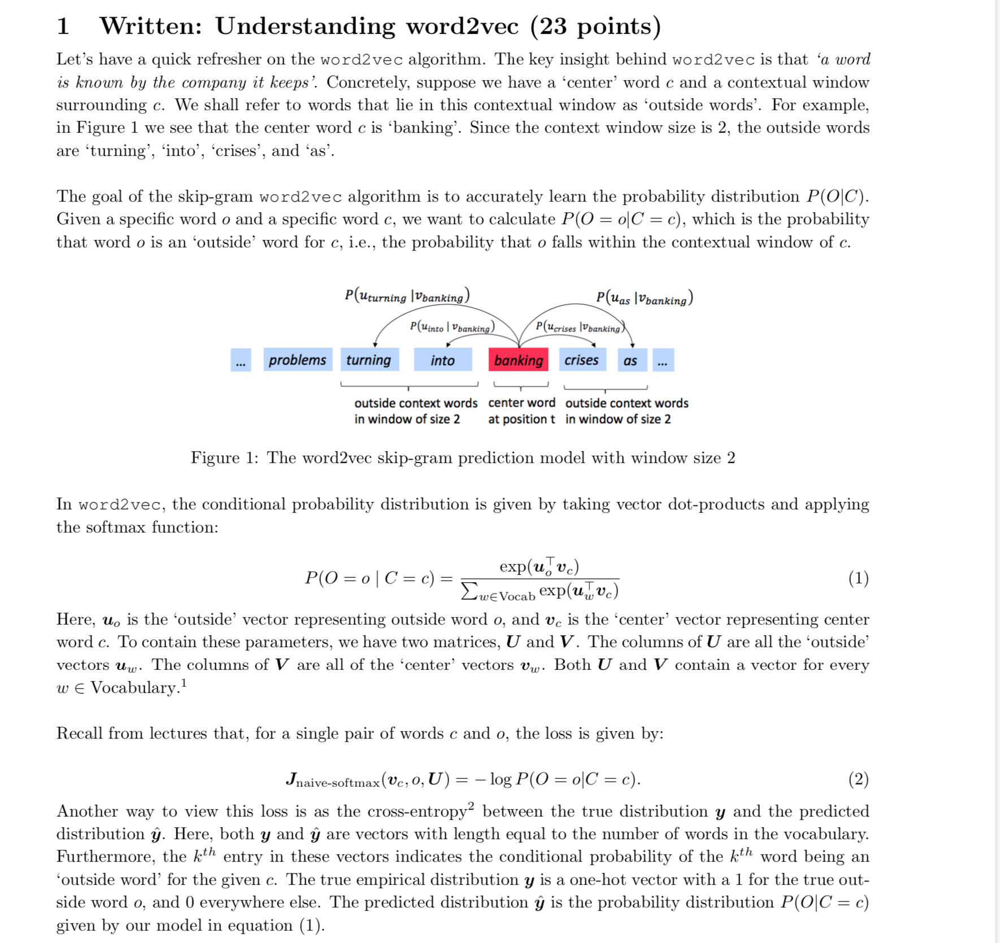
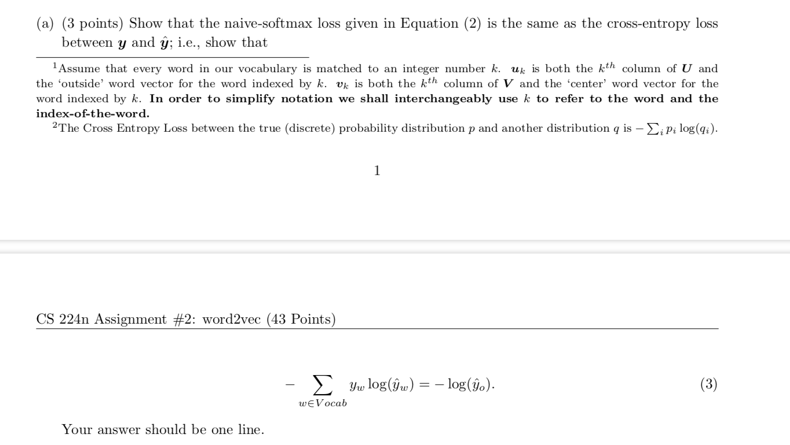
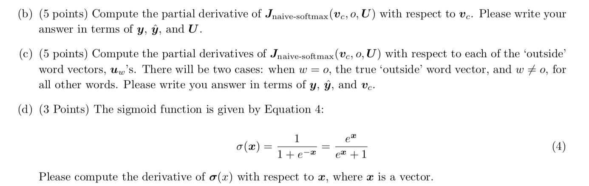

[toc]
 
# Homework2 Solutions

> 注：如下的定义中，矩阵微分都是采用了`numerator layout notation`,比如一个sclar关于列向量的微分是一个行向量……
> 具体查看[wiki](https://en.wikipedia.org/wiki/Matrix_calculus)

## 1. 补充材料学习: 矩阵微商的知识

### 1.1 微商的向量化
假设存在一个函数 $f:\mathbb{R}^n \rightarrow \mathbb{R}^m$, 将一个$n$维向量映射为$m$维向量。
$$f(x)=[f_1(x_1, \cdots, x_n),f_2(x_1, \cdots, x_n), \cdots, f_m(x_1, \cdots, x_n)]$$
那么它的Jacobian 矩阵是$m\times n$维度:

$$\frac {\partial f}{\partial x}= 
\begin{bmatrix}
\frac{\partial f_1}{\partial x_1} &  \cdots & \frac{\partial f_1}{\partial x_n} \\ 
 \vdots & \ddots & \vdots \\
 \frac{\partial f_n}{\partial x_1}& \cdots & \frac{\partial f_m}{\partial x_n}
\end{bmatrix}
$$

$$ \left( \frac{\partial f}{\partial x} \right)_{ij}=\frac{\partial f_i}{\partial x_j}$$

### 1.2 常用的微分预备知识

notes中提及了一些常用的微分公式，有效地帮助了神经网络在计算后向传播梯度时的求解过程。

（1）矩阵$\times$列向量，再关于列向量求导:
$$z=Wx,\ z\in\mathbb{R}^n, \ W \in \mathbb{R}^{n\times m}, x\in \mathbb{R}^m$$

此处可以认为$z$是将$x$从$m$维向量，映射为$n$维向量的一个函数，因此Jacobian矩阵为$n\times m $维。

$$z_i = \sum_{k=1}^m w_{ik}x_k$$

$$(\frac{\partial z}{\partial x})_{ij}=\frac{\partial z_i}{\partial x_j}=\sum_{k=1}^m w_{ik}\frac{\partial x_k}{\partial x_j}=W_{ij}$$

因此 $\frac{\partial z}{\partial x} = W.$

(2) 行向量$\times$矩阵，再关于行向量求导:
$$z=xW, z^T\in \mathbb{R}^n, x^T\in \mathbb{R}^m, W\in \mathbb{R}^{m\times n}$$

其中$$z_i = \sum_{k=1}^m x_k w_{ki}$$

$$\left (\frac{\partial z}{\partial x}\right)_{ij}=\frac{\partial z_i}{\partial x_j}=\sum_{k=1}^m {w_{ki}}\frac{\partial x_k}{\partial x_j}=W_{ji}$$

因此 $\frac{\partial z}{\partial x} = W^T.$

(3) 向量关于自身的导数。
$$z=x, \frac{\partial z}{\partial x}=I$$
\
(4) 由$f(x)$组成的对角矩阵,则只有对角线上有微商:
$$z=f(x),\frac{\partial z}{\partial x}=diag(f'(x))$$

\
(5) 矩阵乘上列向量，要关于矩阵求导 (这个就很类似于神经网络中的参数了):
$$z=Wx,\ z\in\mathbb{R}^n, \ W \in \mathbb{R}^{n\times m}, x\in \mathbb{R}^m$$

假设$J$是损失函数, $\delta=\frac{\partial j}{\partial z}, \text{需要计算}\frac{\partial J}{\partial W}=\frac{\partial J}{\partial z} \frac{\partial z}{\partial W}=\delta \frac{\partial z}{\partial W}$.

对于$\frac{\partial z}{\partial W}$ ，
$$z_k=\sum_{l=1}^m w_{kl}x_l $$
$$\frac{\partial z_k}{\partial W_{ij}}=\sum_{l=1}^mx_l\frac{\partial}{\partial W_{ij}}W_{kl}$$
则$$\frac{\partial z}{\partial W_{ij}}=\begin{bmatrix} 0\\ \vdots \\ 0\\ x_j \\ 0 \\ \vdots \\ 0 \end{bmatrix} \leftarrow \text{第i行}$$
故，$$\frac{\partial J}{\partial W_{ij}}=\frac{\partial J}{\partial z}\frac{\partial z}{\partial W_{ij}}=\delta\frac{\partial z}{\partial W_{ij}}=\sum_{k=1}^m\delta_k\frac{\partial z_k}{\partial W_{ij}}=\delta_i x_j$$
因此，$\frac{\partial J}{\partial W}=\delta^Tx^T.$
\
(6) 行向量乘矩阵，关于矩阵的微商。
$$z=xW$$
假设$J$是损失函数, $\delta=\frac{\partial j}{\partial z}, \text{需要计算}\frac{\partial J}{\partial W}=\frac{\partial J}{\partial z} \frac{\partial z}{\partial W}=\delta \frac{\partial z}{\partial W}$.
$$\frac{\partial J}{\partial W}=x^T\delta.$$

(7) 交叉熵关于logit的微商。
$$\begin{aligned} \hat{y} & =softmax(\theta)\\
J & = CE(\theta),\\
\frac{\partial J}{\partial \theta}  & = (\hat{y}-y)^T
\end{aligned}$$

### 1.3 Gradient Layout
使用Jacobian矩阵很方便，但是我们在后向传播的时候，更倾向于将梯度的维度与该参数保持一致。

### 1.4 一层神经网络的反向传播推导

$$x=input$$
$$z=Wx+b_1$$
$$h=ReLU(z)$$
$$\theta=Uh+b_2$$
$$\hat{y}=softmax(\theta)$$
$$J=CE(y,\hat{y})$$

其中$x\in\mathbb{R}^{D_x\times 1}, b_1\in \mathbb{R}^{D_h\times1},W\in \mathbb{R}^{D_h\times D_x},b_2\in \mathbb{R}^{N_c\times 1},U\in\mathbb{R}^{N_c\times D_h}$,即$D_x$为输入维度，$D_h$为单隐层神经元个数,$N_c$是分类个数。

$$
\begin{aligned}
\frac{\partial J}{\partial U} & = \frac{\partial J}{\partial \hat y}\frac{\partial \hat y}{\partial \theta}\frac{\partial \theta}{\partial U}\\
\frac{\partial J}{\partial b_2} & = \frac{\partial J}{\partial \hat y}\frac{\partial \hat y}{\partial \theta}\frac{\partial \theta}{\partial b_2}
\end{aligned}$$
令
$$\delta_1=\frac{\partial J}{\partial\theta}=(\hat{y}-y)^T$$
$$\delta_2=\frac{\partial J}{\partial z}=\frac{\partial J}{\partial \theta}\frac{\partial \theta}{\partial h}\frac{\partial h}{\partial z}=\delta_1 U \circ sgn(h)$$

因此,如下微商计算的时候，为了更新梯度方便，将最终计算好的微分转置为同当前参数的shape相同。

$$\begin{aligned}
\frac{\partial J}{\partial U} & = \delta_1^Th^T \\
\frac{\partial J}{\partial b_2} & = \frac{\partial J}{\partial \theta}\frac{\partial \theta}{\partial b_2}=\delta_1^T \\
\frac{\partial J}{\partial W} & = \frac{\partial J}{\partial z}\frac{\partial z}{\partial W}=\delta_2^Tx^T\\
\frac{\partial J}{\partial b_1} & = \frac{\partial J}{\partial \theta}\frac{\partial z}{\partial b_1}=\delta_2\frac{\partial z}{\partial b_1}=\delta_2^T\\
\frac{\partial J}{\partial x} & = \frac{\partial J}{\theta}\frac{\partial z}{\partial x}=W^T\delta_2^T
\end{aligned}$$

## 2. Assignment 2

题目截图如下:

(a) 由于真实的$y$是一个one-hot变量，只有命中的时候该求和项才有值，故当$y_w=1$时，故$-\sum_{\omega \in V_{ocab}} y_{\omega}log(\hat y_{\omega})=-log(\hat {y_o})$

(b) 上述损失函数即交叉熵函数 $J=CE(y,\hat y), \hat y = softmax(\theta)$

$$\frac{\partial J}{\partial v_c}=\frac{\partial J}{\partial \theta}\frac{\partial \theta}{\partial v_c}=(\hat{y}-y)^T\frac{\partial U^Tv_c}{\partial v_c}=$$
